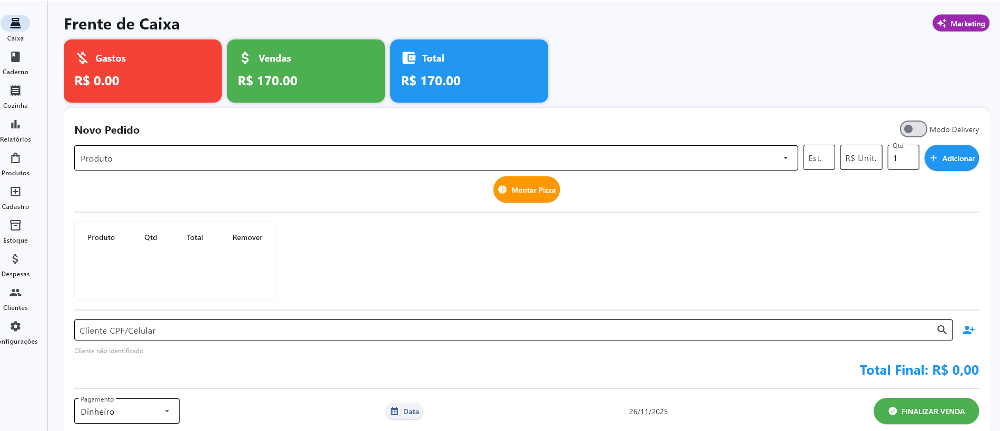
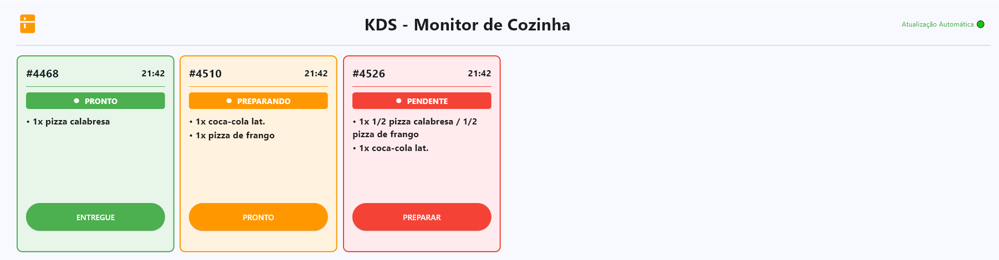
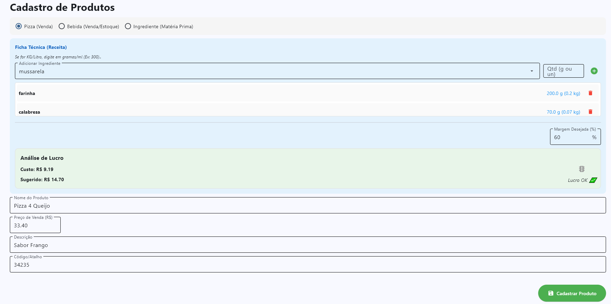
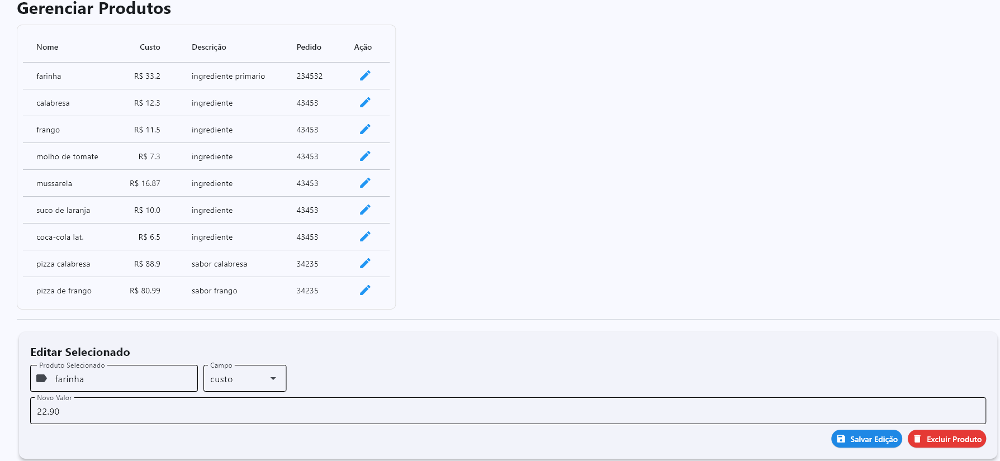
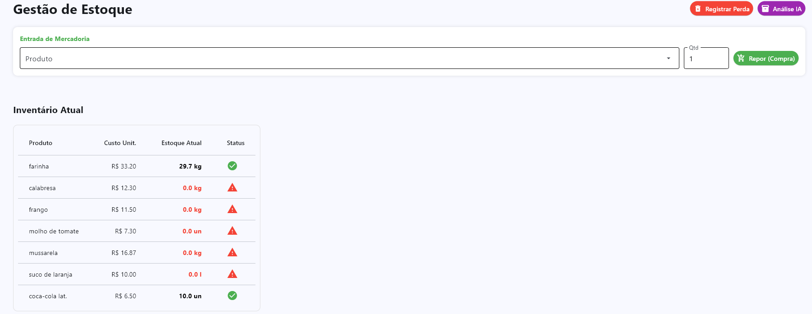
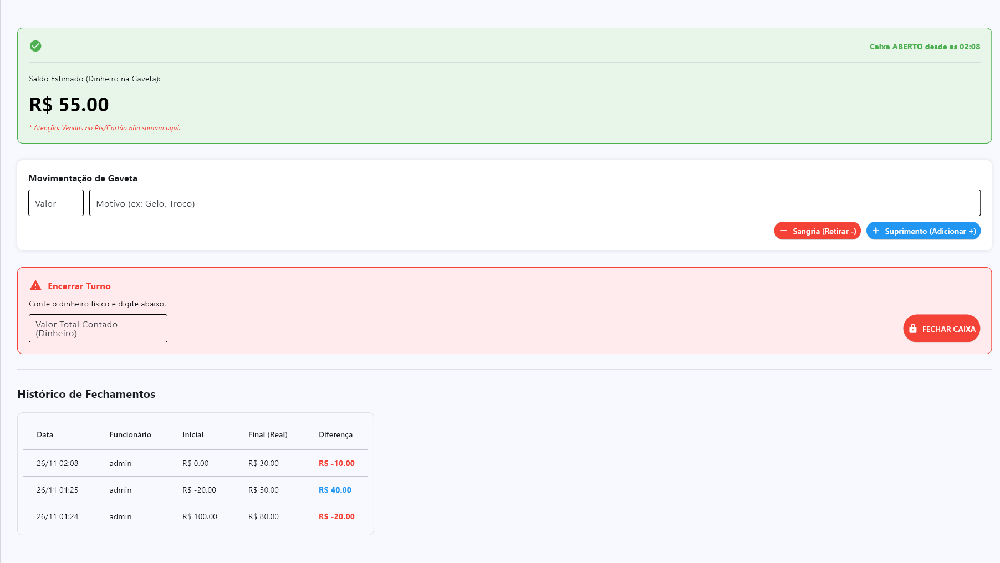
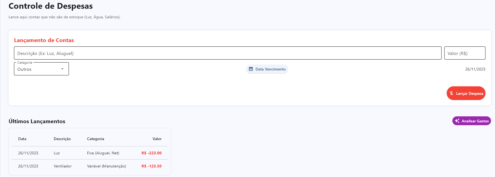
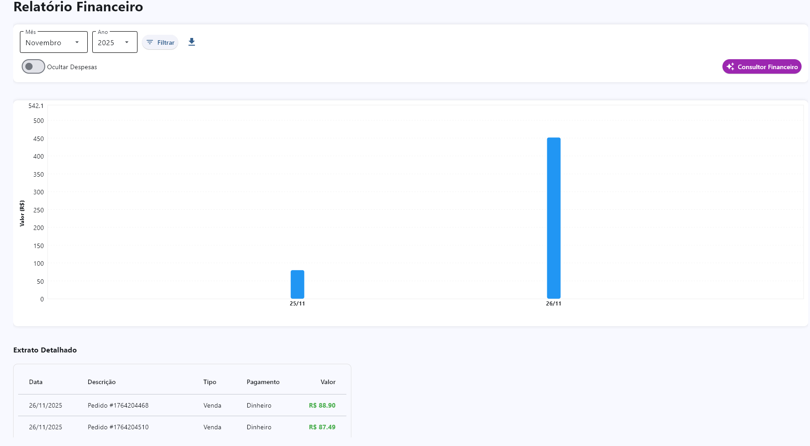
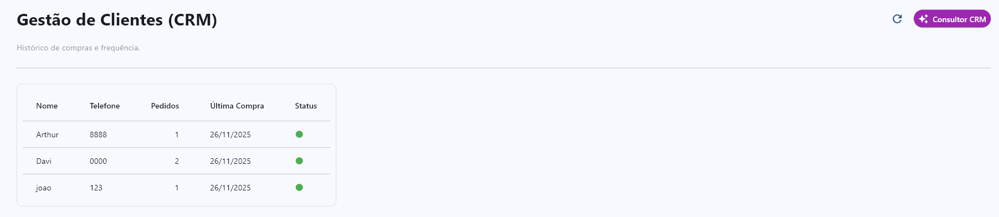

<div align="center">
   
  <h1>CAIXA CERTO</h1>
  <h3>Sistema Integrado de Gestão para Pequenos Negócios</h3>
  
  <p>
    Uma solução <b>Desktop</b> robusta, desenvolvida em Python, focada em transformar a complexidade financeira em simplicidade operacional.
  </p>

  <p>
    
    
    
  </p>

  <br />
  
  <a href="#-funcionalidades">Funcionalidades</a> •
  <a href="#-tecnologias">Tecnologias</a> •
  <a href="#-instalação">Instalação</a>
</div>

<hr />

<h2 align="center">Visão Geral</h2>
<p align="center">
  O <b>Caixa Certo</b> não é apenas um PDV. É um ecossistema que conecta a frente de caixa à cozinha, controla o estoque com inteligência e traduz vendas em relatórios financeiros claros. Juntamente com um <i>IA</i> para analisar suas vendas, despesas e fluxo de clientes trazendo dicas, promoções e ajustes precisos que um ser humano não conseguira notar. Projetado com uma interface <i>Clean</i> para reduzir o cansaço visual do operador.
</p>

<br />

<h2 align="center">Tour pelo Sistema</h2>

<div id="caixa">
  <h3>1. Frente de Caixa (PDV) de Alta Performance</h3>
  <p>Projetada para agilidade. Permite busca rápida de produtos, Sessão dinâmica para MotoBoys e Delivery em geral, identificação de cliente via CPF/Celular e múltiplos métodos de pagamento. Interface limpa para evitar erros operacionais.</p>
  <div align="center">
    
  </div>
</div>

<br><br>

<div id="kds">
  <h3>2. KDS (Kitchen Display System)</h3>
  <p>Adeus às impressoras de papel. O monitor de cozinha sincroniza pedidos em tempo real, utilizando cartões coloridos (Color Code) para indicar status: 🟠 <b>Preparando</b>, 🟢 <b>Pronto</b> ou 🔴 <b>Pendente</b>.</p>
  <div align="center">
    
  </div>
</div>

<br><br>

<div id="produtos">
  <h3>3. Engenharia de Cardápio e Custos</h3>
  <p>O sistema calcula automaticamente o <b>Preço de Custo</b> baseado na Ficha Técnica (receita) do produto. Ao cadastrar os ingredientes (ex: farinha, queijo), o sistema sugere o preço de venda para garantir a margem de lucro.</p>
  <div align="center">
    
    
  </div>
</div>

<br><br>

<div id="estoque">
  <h3>4. Gestão de Estoque Inteligente</h3>
  <p>Monitoramento ativo de insumos. O sistema emite alertas visuais ⚠️ para itens críticos ou zerados, prevenindo a falta de mercadoria durante o serviço.</p>
  <div align="center">
    
  </div>
</div>

<br><br>

<div id="financeiro">
  <h3>5. Controle Financeiro 360º</h3>
  <p>Visão completa da saúde do negócio. O <b>Caderno de Caixa</b> registra sangrias e suprimentos com auditoria de fechamento de turno. O módulo de <b>Despesas</b> organiza contas fixas e variáveis.</p>
  <div align="center">
    
    
  </div>
</div>

<br><br>

<div id="relatorios">
  <h3>6. Dashboards e CRM</h3>
  <p>Transforme dados em decisões. Gráficos de faturamento diário/mensal e gestão de relacionamento com clientes (CRM) para estratégias de fidelização.</p>
  <div align="center">
    
    
  </div>
</div>

<hr />

<h2 align="center" id="-tecnologias">Arquitetura e Tecnologia</h2>

<p>
  O projeto foi desenvolvido seguindo o padrão arquitetural <b>MVC (Model-View-Controller)</b> modificado, garantindo desacoplamento entre a lógica de negócio e a interface do usuário.
</p>

<table align="center">
  <tr>
    <td align="center" width="100">
      
      <br><b>Core</b>
    </td>
    <td align="center" width="100">
      
      <br><b>MongoDB</b>
    </td>
    <td align="center" width="100">
      
      <br><b>Analytics</b>
    </td>
  </tr>
</table>

<ul>
  <li><b>Interface Gráfica:</b> Flet (UI moderna baseada em Widgets nativos com motor do <i>FLUTTER</i>).</li>
  <li><b>Banco de Dados:</b> MongoDB/Atlas (Armazenamento simples e em Nuvem para uma aplicação sempre ativa) .</li>
  <li><b>Manipulação de Dados:</b> Pandas para geração de relatórios complexos e exportação.</li>
</ul>

<hr />

<h2 id="-instalação">Testando nosso projeto</h2>
Para testar nosso projeto, é necessario apenas instalar o executável disponível na pasta <i>EXE</i>

<h2 id="-instalação">Instalação e Execução</h2>

```bash
# 1. Clone o repositório
git clone [https://github.com/Arth1022/CaixaCerto.git]

# 2. Entre na pasta
cd CaixaCerto

# 3. Instale as dependências
pip install -r requirements.txt

#4. User um .env com os dados do seu MongoDB e API do GEMINI
API_DA_IA = "Sua chave"
DB = "Seu URI"

# 5. Execute a aplicação
python main.py
